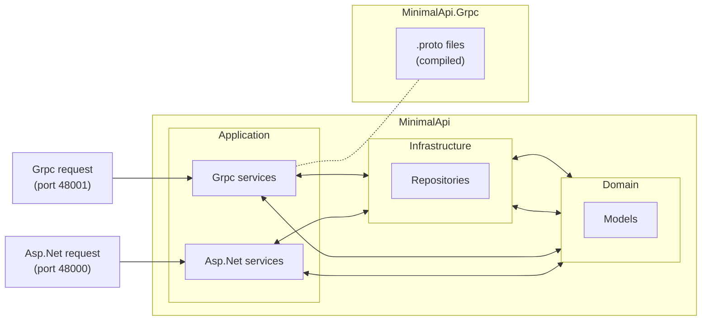

# Minimal Api with Grpc
This is just a project to test C# Minimal Api with Grpc coexistence.

## Project structure



The project structure is composed of two projects:

### MinimalApi.Grpc
This project contains the .proto files definitions.

When this project is built, it will autogenerate the C# code through [Grpc.Tools](https://www.nuget.org/packages/Grpc.Tools/) Nuget package.

The generated Grpc code will be used by the Grpc services, in the main project (ie.: [PersonGrpcService](https://github.com/humaranah/MinimalApiWithGrpc/blob/main/source/MinimalApi/Application/PersonGrpcService.cs)).

### MinimalApi
This project contains all the interaction logic of the API and Grpc services. It is composed of a very basic DDD folder structure (just for testing).

The sample data is autogenerated using [Bogus](https://www.nuget.org/packages/Bogus/) faker package.

## Working with ASP.Net and Grpc together
There are some considerations about working with both technologies in the same project:

From my experience with this research, Grpc calls require using Http/2 protocol exclusively. In the other hand, ASP.Net endpoints have some issues trying to work in that mode.

The quicker way I found to fix this was by listening two different ports:
- The first listener with `Http1AndHttp2` mode, for ASP.Net requests.
- The second listener with `Http2` mode exclusively, for Grpc requests.

The following code can be found in [Program.cs](source/MinimalApi/Program.cs):
```csharp
builder.WebHost.ConfigureKestrel(options =>
{
    // Asp.Net calls should use 'http://localhost:50000'
    // and Grpc calls should use 'http://localhost:50001'
    options.ListenLocalhost(50000, config => config.Protocols = HttpProtocols.Http1AndHttp2);
    options.ListenLocalhost(50001, config => config.Protocols = HttpProtocols.Http2);
});
```

**Note:** I disabled SSL/TLS in this project since it is intended just for testing that Asp.Net can work with Grpc together. That configuration **should not** be used in a production environment for security reasons.
